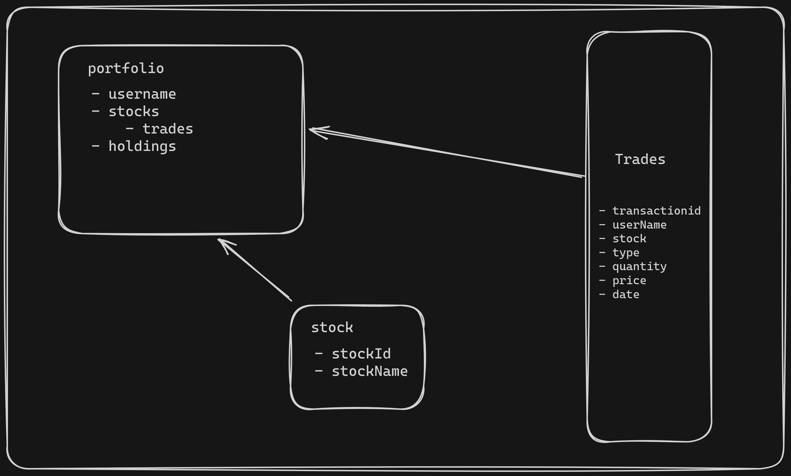

# Portfolio API Design Document

## 1. Introduction

The Portfolio API is a RESTful service designed to track a user's portfolio, allowing the addition, deletion, and updating of trades, and performing basic return calculations. 
In this usecase and for simplicity, we assume there will be only one portfolio and one user.

## 2. Models

### 2.1 Stock

A Stock is represented by an alphanumeric id.

### 2.2 Trade

A Trade captures the following details:

- Date
- Price
- Type (buy/sell)

### 2.3 Portfolio

A Portfolio is an aggregation of stocks and their associated trades.

## 3. Functionality

The API will provide the following functionality:

- Retrieve the entire portfolio with all trades
- Add, delete, and modify trades
- Calculate the average buying price and cumulative return
- Each trade can be identified by a transaction Id
- Updating each trade will update the transaction Id
### 3.1 Data model


## 4. API Routes
Desinge doc for the api can be found here

| Endpoint | Method | Description | Request Body | Response Body |
| --- | --- | --- | --- | --- |
| `/portfolio` | GET | Retrieves the entire portfolio with all trades | None | Array of portfolio objects |
| `/portfolio/holdings` | GET | Retrieves the holdings in an aggregate view | None | Array of holding objects |
| `/portfolio/returns` | GET | Retrieves the cumulative returns | None | Object containing cumulative returns |
| `/addTrade` | POST | Adds a new trade to the portfolio | Trade object | Confirmation message |
| `/updateTrade` | POST | Updates an existing trade in the portfolio | Trade object | Confirmation message |
| `/removeTrade` | POST | Removes an existing trade from the portfolio | Trade object | Confirmation message |

Design doc for the api can be found [here](docs/DesignDoc.md)

Here are some example requests and responses using curl for the endpoints in the provided [Postman collection](docs/portfolioAPI.postman_collection.json):

### Add Trade

Request:
```bash
curl -X POST \
  http://localhost:3000/portfolio/addTrade \
  -H 'Content-Type: application/json' \
  -d '{
    "stockId": "GOOGL",
    "type": "buy",
    "quantity": 1,
    "price": 50,
    "date": "2024-03-27",
    "username": "John Doe"
}'
```
Response:
```json
{
    "success": true,
    "data": {
        "transactionId": "1ea0a23b-675f-4a94-89a8-0c4dbf1889c6"
    }
}
```
### Get Portfolio

Request:
```bash
curl -X GET \
  http://localhost:3000/portfolio \
  -H 'Content-Type: application/json'
```
Response:
```json
{
    "success": true,
    "data": [
        {
            "username": "John Doe",
            "stocks": [
                {
                    "id": "GOOGL",
                    "name": "Alphabet Inc.",
                    "trades": [
                        {
                            "date": "2024-03-27T00:00:00.000Z",
                            "type": "buy",
                            "quantity": 2,
                            "price": 50
                        },
                        {
                            "date": "2024-03-27T00:00:00.000Z",
                            "type": "buy",
                            "quantity": 1,
                            "price": 50
                        }
                    ]
                },
                {
                    "id": "FB",
                    "name": "Facebook, Inc",
                    "trades": [
                        {
                            "date": "2024-03-27T00:00:00.000Z",
                            "type": "sell",
                            "quantity": 1,
                            "price": 100
                        },
                    ]
                },
                {
                    "id": "HDFCBANK",
                    "name": "HDFCBANK, Inc",
                    "trades": [
                        {
                            "date": "2024-03-27T00:00:00.000Z",
                            "type": "buy",
                            "quantity": 1,
                            "price": 100
                        },
                        {
                            "date": "2024-03-27T00:00:00.000Z",
                            "type": "buy",
                            "quantity": 1,
                            "price": 100
                        }
                    ]
                }
            ],
            "portfolioDetails": {
                "total_stocks": 3
            }
        }
    ]
}
```
### Get Holdings

Request:
```bash
curl -X GET \
  http://localhost:3000/portfolio/holdings \
  -H 'Content-Type: application/json'
```
Response:
```json
{
    "success": true,
    "data": {
        "GOOGL": {
            "quantity": 3,
            "avg_buy_price": 50
        },
        "FB": {
            "quantity": 30,
            "avg_buy_price": 20
        },
        "HDFCBANK": {
            "quantity": 9,
            "avg_buy_price": 100
        }
    }
}
```
### Update Trade

Request:
```bash
curl -X POST \
  http://localhost:3000/portfolio/updateTrade \
  -H 'Content-Type: application/json' \
  -d '{
    "transactionId": "1ea0a23b-675f-4a94-89a8-0c4dbf1889c6",
    "quantity": 1
    "price": 50
}'
```
Response:
```json
{
    "success": true,
    "data": {
        "transactionId": "1ea0a23b-675f-4a94-89a8-0c4dbf1889c6",
        "updatedTrade": {
            "date": "2024-03-27T00:00:00.000Z",
            "type": "buy",
            "quantity": 1,
            "v": 50
        }
    }
}
```
### Remove Trade

Request:
```bash
curl -X POST \
  http://localhost:3000/portfolio/removeTrade \
  -H 'Content-Type: application/json' \
  -d '{
    "transactionId": "0ff25233-15d3-4544-a0af-ef347d066ef6",
}'
```
Response:
```json
{
    "success": true,
    "data": "Trade Removed"
}
```
### Health

Request:
```bash
curl -X GET \
  http://localhost:3000/health \
  -H 'Content-Type: application/json'
```
Response:
```json
{
    "success": true,
    "data": "Ok"
}
```
## 5. Technology Stack

We will use Node.js for the backend, MongoDB as the database, Mongoose as the ORM, and Express.js as the web application framework. We will use chai and mocha for testing the API endpoints.


## 6. Testing

We will use chai and mocha to test our API endpoints. Unit tests and integration tests will be written to ensure the functionality and reliability of the API.

## 7. Possible Improvements

- **Authentication**: In a real-world scenario, we would need to implement user authentication to secure the API endpoints.
- **Multiple Portfolios**: The API could be extended to support multiple portfolios and users.
- **Real-time Stock Prices**: The API could be integrated with a service that provides real-time stock prices for more accurate return calculations.